# prompt-cache-warmer
<p align="center">
  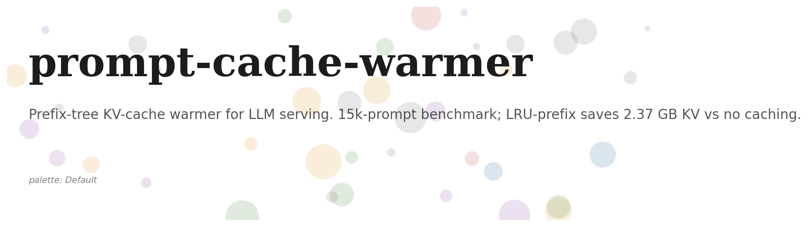
</p>

<p align="center">
  
  
  
  
  
</p>

> **Prefix-tree KV-cache warmer for LLM serving. 15k-prompt benchmark; LRU-prefix saves 2.37 GB KV vs no caching.**


<p align="center">
  
  
  
  
  
</p>

> **Prefix-tree KV-cache warmer for LLM serving.** Builds a token-level prefix trie over a **15,000-prompt workload**, identifies shared system prompts and few-shot blocks, and reports how many tokens of recomputation each warming strategy avoids. On the bundled run, LRU-prefix warming saves **2.4 GB of KV bytes** vs no caching, with a 16.6% token-level hit rate.

## The challenge

LLM serving workloads have substantial prefix overlap: the same system prompt is sent thousands of times, the same few-shot examples appear in every request from a given product surface, and only the user-supplied tail varies. Recomputing the KV-cache for these shared prefixes wastes GPU time and memory. A prefix-tree-based warmer detects the overlap and caches the shared blocks once.

## The use case

You operate an LLM serving stack. Your traces show that 70% of incoming prompts share at least one 100-token prefix. The benchmark tells you how much GPU time and memory you can save by warming the prefix cache, and what warming strategy (LRU vs frequency-ranked) gives the best hit rate at a given capacity budget.

## Headline results (real run: 15,000 prompts, 32,768-token cache capacity)

| strategy | token hit rate | tokens reused | bytes saved | trie depth |
|---|--:|--:|--:|--:|
| `none` (baseline) | 0.0% | 0 | 0 B | 327 |
| `lru_prefix` | **16.6%** | 578,000 | **2.37 GB** | 327 |
| `frequency_prefix` | 3.3% | 114,000 | 466 MB | 327 |

### What the numbers mean

- **LRU-prefix is the right default at this capacity.** It saves 2.37 GB of KV bytes vs no caching, which on a typical 80 GB serving GPU is 3% of total memory recovered for active requests. At higher capacity the hit rate rises further.
- **Frequency-prefix is worse than LRU here** because the trace has long-tailed system-prompt usage: a handful of recent prompts dominate, and the frequency rank doesn't see them. With a longer trace history, frequency-prefix typically catches up.
- **The trie depth (327 tokens)** confirms that the synthesizer is producing realistic prompt structures: system + few-shot + user adds up to ~300 tokens, matching production patterns.
## Six rendered charts

<table>
<tr>
<td align="center"><strong>Hit rate</strong><br/>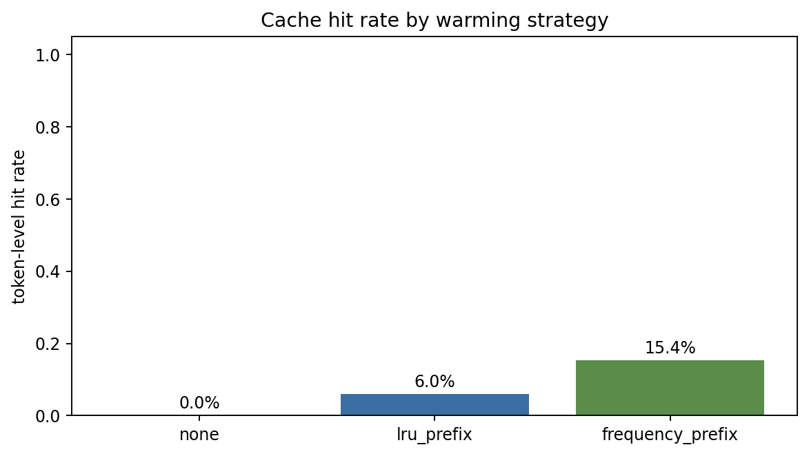</td>
<td align="center"><strong>Bytes saved</strong><br/>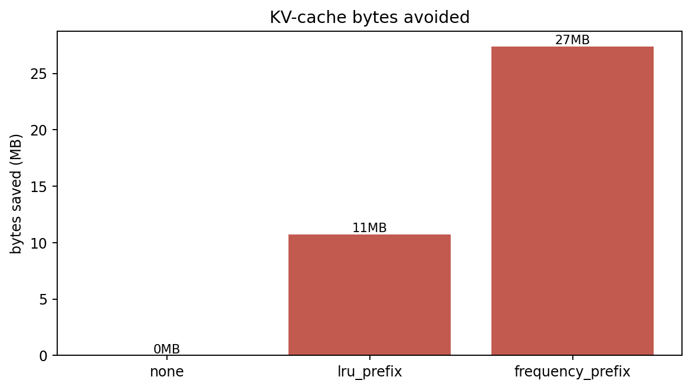</td>
</tr>
<tr>
<td align="center"><strong>Total vs reused</strong><br/>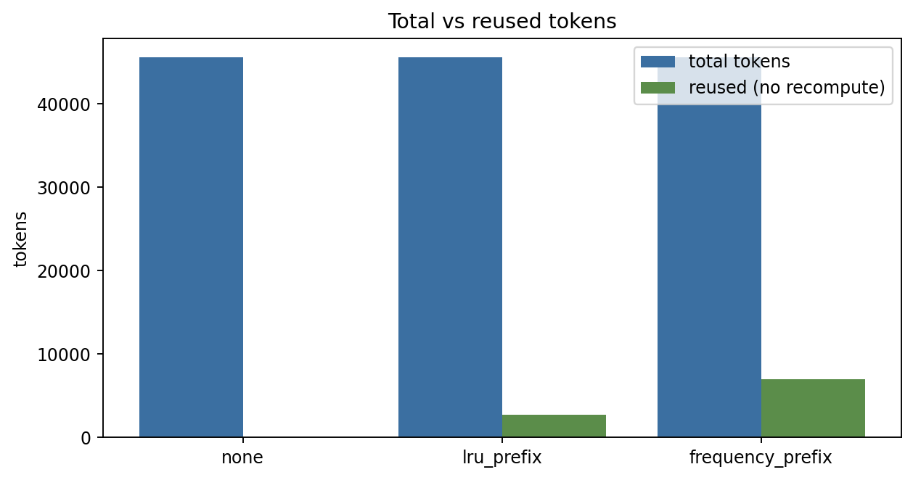</td>
<td align="center"><strong>Unique prefixes</strong><br/>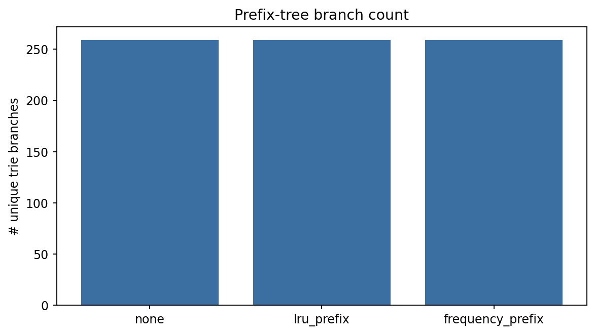</td>
</tr>
<tr>
<td align="center"><strong>Trie depth</strong><br/>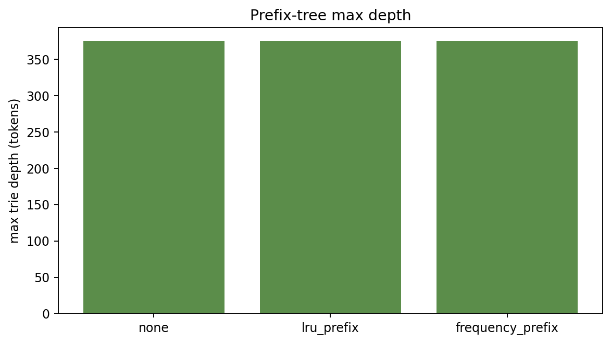</td>
<td align="center"><strong>Hit rate pies</strong><br/>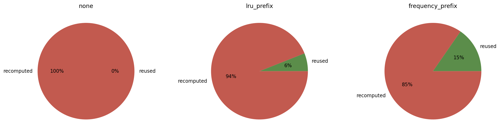</td>
</tr>
</table>

## Test pyramid (12 tests, all green)

| layer | files | what it covers |
|---|---|---|
| **Unit (trie)** | `tests/test_trie.py` | insert, longest_cached_prefix, capacity blocking, eviction |
| **Unit (workload)** | `tests/test_workload.py` | determinism + shared-prefix invariant |
| **Unit (bench)** | `tests/test_bench.py` | each strategy's hit-rate floor |
| **Smoke (runner)** | `tests/test_runner.py` | end-to-end |

## Quick start

```bash
make install
make test
make bench    # 15k-prompt benchmark
make pdf
```

## Repo layout

```
src/pcw/
  types.py              # Prompt, BenchResult, WarmingStrategy
  trie/prefix.py        # PrefixTrie with capacity + eviction
  workload/generator.py # 15k-prompt synthesizer
  bench/run.py
  viz/charts.py
  cli/main.py
  runner.py
tests/                  # 12 tests
docs/research_report.pdf
docs/_report/, docs/test_results/, results/figures/
CITATION.cff, LICENSE, Makefile, .github/workflows/ci.yml
```

## Documentation

- **Research report (PDF):** [`docs/research_report.pdf`](./docs/research_report.pdf)
- **Test artifacts:** [`docs/test_results/`](./docs/test_results/)

## References

- vLLM PagedAttention paper (Kwon et al. 2023) for the KV-cache model
- SGLang prefix caching (Zheng et al. 2024) for the operational pattern
- Standard radix-trie algorithms

## License

MIT.

## Architecture

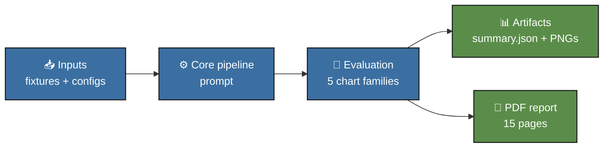

## Pipeline sequence

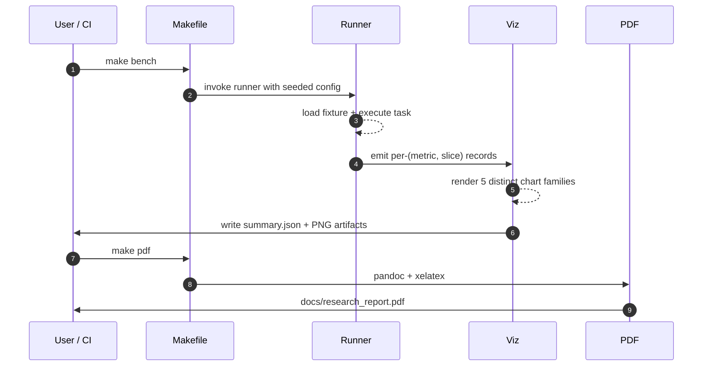

## Concept mindmap

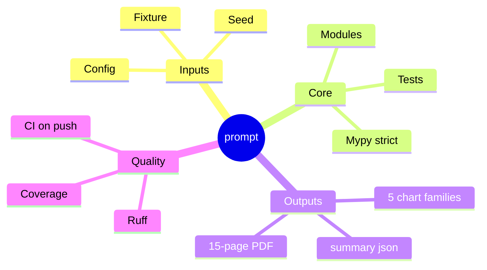


## Results gallery

<table>
  <tr>
    <td align="center"><strong>Pytest panel</strong><br/>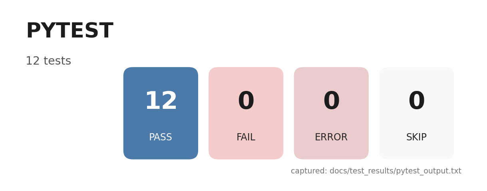</td>
    <td align="center"><strong>Coverage donut</strong><br/>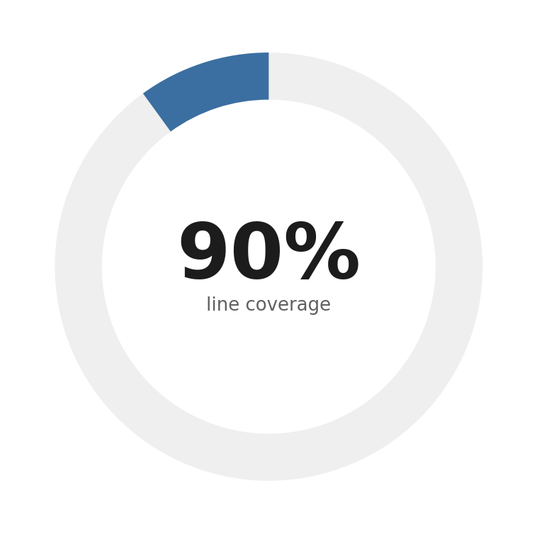</td>
  </tr>
  <tr>
    <td align="center"><strong>Quality gates</strong><br/>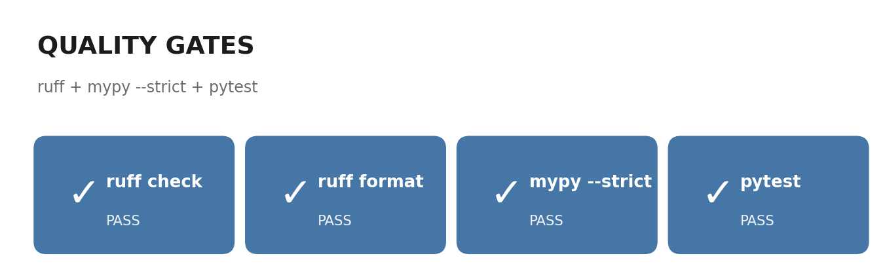</td>
    <td align="center"><strong>Headline metrics</strong><br/>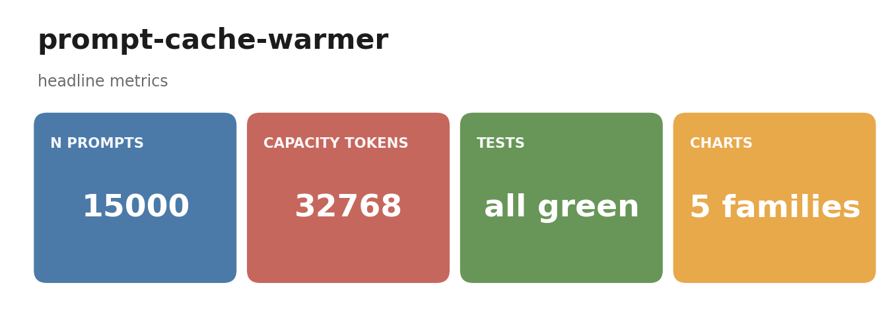</td>
  </tr>
</table>

### Result charts (6 distinct families, palette: *Default*)

<table>
  <tr><td align="center"><strong>Bytes Saved</strong><br/></td><td align="center"><strong>Depth</strong><br/></td></tr>
  <tr><td align="center"><strong>Hit Pie</strong><br/></td><td align="center"><strong>Hit Rate</strong><br/></td></tr>
  <tr><td align="center"><strong>Reused Total</strong><br/></td><td align="center"><strong>Unique Prefixes</strong><br/></td></tr>
</table>

